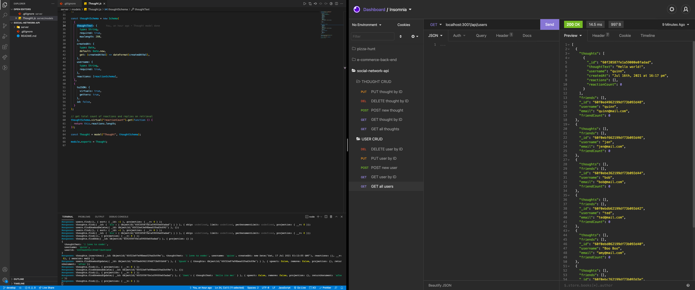

<h1 align="center">Social Network API</h1>
<p align="center">A NoSQL Demonstration</p>

<p align="center">
    
    
    
    
</p>
  
<p align="center">
    
    
    
</p>

## Discrption

Social Network API is an API for a social network web application where users can share their thoughts, react to friends’ thoughts, and create a friend list. Express.js is used for routing, MongoDB is used for the database, and Mongoose is used for the ODM.

## User Story

The following is an example of a how a user might like to use this application:

```
AS A social media startup
I WANT an API for my social network that uses a NoSQL database
SO THAT my website can handle large amounts of unstructured data
```

## Application Functioanlity

The following is the funcatioanlity that the application will consist of based on the users requests mentioned above:

```
GIVEN a social network API
WHEN I enter the command to invoke the application
THEN my server is started and the Mongoose models are synced to the MongoDB database
WHEN I open API GET routes in Insomnia Core for users and thoughts
THEN the data for each of these routes is displayed in a formatted JSON
WHEN I test API POST, PUT, and DELETE routes in Insomnia Core
THEN I am able to successfully create, update, and delete users and thoughts in my database
WHEN I test API POST and DELETE routes in Insomnia Core
THEN I am able to successfully create and delete reactions to thoughts and add and remove friends to a user’s friend list
```

## Snapshot




## Installing Dependencies

Enter the following command to install the required Node Package Modules:

`npm install mongoose express`

## Running the Application

Enter `npm start` into the CLI in the root directory. Then open up insomnia c

## Contibutions

[Kyle Wilson](https://github.com/lylekilson)
